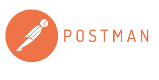

# WTA learning objectives

## **Úvod do testovania**
---
Naučili sme sa 7 princípov testovania
---
Povedali sme si prečo je dôležité testovať.

Pokúšali sme sa testovať výťah.

Vysvetlili sme si pojmy Omyl, Defekt, Zlyhanie
*(Dozvedeli sme sa aj preco sa bug vola [bug](https://www.computerimages.com/musings/computer_bug.html#) :joy:)*

## **Typy testov**
- Naucili sme sa rozdiel medzi **Frontend** a **Backend**
- Naučili sme sa, že **Frontend** je užívateľské rozranie
- **Backend** zahŕňa servery a databázy
### Urovne testovania
- Testovanie komponentov
- Integračné testovanie komponentov
- Systémové testovanie
- Systémové integračné testovanie 
- Akceptačné testovanie

### Typy testov
- Funkcionálne testovanie
- Nefunkcionálne testovanie
- Testovanie čiernej skrinky
- Testovanie bielej skrinky
- Testovanie súvisiace so zmenami

## **Session based testing** 
**Naučili sme sa čo všetko má obsahovať report**
### Exploratory testing
- Forma testovania pre základnú verifikáciu produktu
- Analýza a písanie testov sa robia zároveň s testovaním
- Sloboda a zodpovednosť testera/ky je nadradená procesom
- Používané pri agilnom vývoji
- Vysvetlili sme si **automatizačnú pyramídu**.
- Vyskúšali sme si prvý skupinový projekt.

### Session based testing
- Mission 
- Charter
- Session
- Report
- Debrief
### Session 1
Otestujte kalkulačku
- (http://ajtyvit-app.westeurope.cloudapp.azure.com:8080/kalkulacka.php)
### Session 2
Otestujte cestovné poriadky na cp.sk
- (https://cp.sk/vlakbusmhd/spojenie/)

## **Jira and Bug**
Jira je najpopulárnejší nástroj na riadenie projektu, existuje
- serverová (on-premise)
- online(cloudova)

- Vyskúšali sme si zadávanie Bugov v JIRE
- Do JIRY si môžeme inštalovať rôzne pluginy

Nástroj na testovanie

## **Manažment testovania**
Učili sme sa pracovať s nástrojom TestRail.
Vysvetlili sme si rozdiel medzi manazmentom testovania a testov.
Ozrejmili sme si testovacie roly a urovne.
Rozobrali sme plánovanie testovania.
Venovali sme sa aj metrikám testovania

## **Modely vývoja software-u** 
Vysvetlili sme si **SDLC** a **STLC** 

Sekvenčné modely 
1. Waterfall
2. V-model
3. W-model

Cykliké vývojové modely
1. Inkrementálny
2. Iteratívny

Agilný vývoj
1. Extrémne programovanie XP
2. Techniky BDD, TDD
3. Metodika Lean softvare development
4. Metodika Kanban
5. Metodika DevOps
6. Metodika Srum

## **Techniky tvorby testov**
## Kategórie techník návrhu testov ##
- Založené na špecifikácii (čierna skrinka).
Tu patria tieto techniky: 
1. Rozdelenie ekvivalencie
2. Analýza hraničných hodnôt
3. Testovanie rozhodovacích tabuliek
4. Testovanie prechodu stavov 
5. Testovanie prípadov použitia

- Založené na štruktúre (biela skrinka).
1. Pokrytie príkazov
2. Pokrytie rozhodnutí
3. Pokrytie podmienok
- Založené na skúsenostiach.
1. Odhadovanie omylov, 
2. Prieskumné testovanie

- Založené na skúsenosti: Testy sú odvádzané zo znalostí a intuície testerov a ich skúsenosti s podobnými aplikáciami a technológiami. 
1. Odhadovanie omylov
2. Prieskumné testovanie

## **HTML, CSS, JavaScript**
## HTML ##
- Hypertext Markup Language
- Popisný jazyk
- Definuje štruktúru stránky
---

- Povedali sme si, čo je HTML, CSS a JavaScript
- Vyskúšali naprogramovať stránku.

## **Nástroje testovania** 
### Načo nám slúžia nástroje ###
- plánovanie, sprehľadnenie nápadov
- manažment testovania
- zefektívnenie testovania
- nahradenie manuálneho testovania
- umožnenie testovania

## **Testovanie API** 
- Povedali sme si teoretické základy o API, REST API a protokole HTTP
- Testovali sme API cez nástroj Postman
- naučila som sa rozdiel medzi https a http

## **SQL** 
**HTTP request - metódy** 
- GET
- POST
- PUT
- DELETE
---

- tvorenie databázy
- Vysvetlili sme si čo je to SQL.
- Naučili sme sa základné príkazy.
- Tu je link na SQL cvičenia:
[W3school](https://www.w3schools.com/sql/sql_exercises.asp
)
- Hrali sme sa s SQL online (https://sqliteonline.com/)
